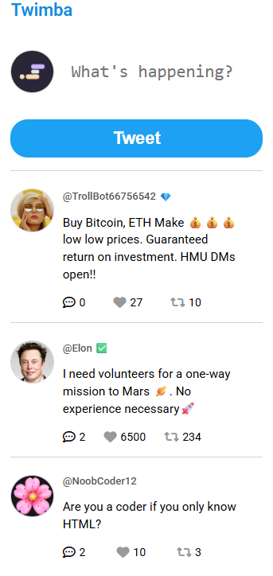

# X Clone

A responsive front-end clone of **X (formerly Twitter)** built with HTML, CSS, and JavaScript.

This project was created as a front-end development project to practice building a social media interface, working with JavaScript, and recreating a modern responsive UI from scratch.

## 🚀 Features

- X-inspired social media interface
- Responsive layout
- Navigation sidebar
- Home feed
- Post/tweet layout
- User profile information
- Interactive UI elements
- Custom styling with CSS
- JavaScript-driven functionality
- Local image assets

## 🛠️ Built With

- **HTML5** – Page structure
- **CSS3** – Styling, layout, and responsive design
- **JavaScript** – Interactivity and dynamic content
- **Vite** – Development environment and build tool

## 📂 Project Structure

```text
x-clone/
│
├── images/
├── data.js
├── index.css
├── index.html
├── index.js
├── package.json
├── vite.config.js
└── README.md
```

## 💻 Getting Started

### 1. Clone the repository

```bash
git clone https://github.com/Jabezgreenan/x-clone.git
```

### 2. Navigate into the project

```bash
cd x-clone
```

### 3. Install dependencies

```bash
npm install
```

### 4. Start the development server

```bash
npm run dev
```

Open the local development URL provided by Vite in your browser.

## 🎯 Purpose

The goal of this project was to strengthen my front-end development skills by recreating a familiar social media platform from scratch.

Through this project, I practiced:

- Structuring a larger HTML interface
- Creating responsive layouts with CSS
- Using JavaScript to control page interactions
- Working with arrays and objects
- Rendering content dynamically
- Organizing project files
- Using Vite for development
- Building a UI based on an existing design

## 📸 Project Preview



## ⚠️ Disclaimer

This project is a **fan-made educational clone** created for learning and portfolio purposes. It is not affiliated with, sponsored by, or endorsed by X Corp.

## 👨‍💻 Author

**Jabez Greenan**

- GitHub: https://github.com/Jabezgreenan
- LinkedIn: https://www.linkedin.com/in/jabez-greenan-60b434271/

---

⭐ If you found this project interesting, feel free to explore the code and see how it was built.
